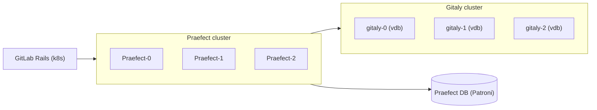

# Role 30: Operations on Gitaly and Praefect

Configures Gitaly (git repository storage) and Praefect (Gitaly HA proxy) nodes for GitLab.
Supports topology-driven mode selection: when Praefect nodes are present in inventory, Gitaly nodes operate in clustered mode (`gitaly-N` storage name); when absent, they fall back to standalone mode (`default` storage name) automatically.

## Section 1. Overview

### Architecture



Praefect uses a Postgres database (Patroni cluster on `praefect-patroni` nodes) to track repository routing metadata. All three Gitaly nodes hold full replicas; Praefect routes reads and writes, and replicates writes to non-primary nodes.

### Task Structure

- **`A-data-disk.yaml`**
    - **Trigger:** Every deploy, gitaly nodes only
    - **Description:** Format and mount `/dev/vdb` at `/var/opt/gitlab/git-data`. Idempotent; ownership enforced unconditionally outside the mount block.

- **`B-service.yaml`**
    - **Trigger:** Every deploy, gitaly + praefect nodes
    - **Description:** Render `gitlab.rb`, configure Vault Agent for TLS, run `gitlab-ctl reconfigure`.

- **`C-migrate-to-praefect.yaml`**
    - **Trigger:** Every deploy, primary Praefect node only
    - **Description:** Reconcile on-disk repos into Praefect DB. Idempotent: queries DB for already-tracked repos, tracks only the delta.

- **`C-migrate-to-standalone.yaml`**
    - **Trigger:** Manual operation only (via `entry.sh`)
    - **Description:** Safety pre-check before reverting to standalone. Delegates `praefect dataloss` to the primary Praefect node and fails if `gitaly-0` has missing replicas.

## Section 2. Forward Migration: Standalone Gitaly to HA Praefect

This path is automatic. On every `terraform apply`, `C-migrate-to-praefect.yaml` runs on the primary Praefect node and reconciles any on-disk repositories that are not yet tracked in the Praefect DB.

### Functions

1. Finds all `*.git` directories under `gitaly_repo_base_path` on `gitaly-0`, excluding the `+gitaly/` internal state prefix.
2. Queries the Praefect DB for already-tracked `relative_path` values.
3. Builds the diff and writes a NDJSON input file for `praefect track-repositories`.
4. Runs `track-repositories --replicate-immediately`, which registers each missing repo and triggers replication to all other Gitaly nodes.

### Self-healing scenarios

- Praefect DB rebuilt from scratch (e.g., Patroni `initdb` after debug): next deploy re-tracks all repos.
- New Gitaly node added to tfvars: `--replicate-immediately` pushes all repos to the new node.
- Praefect node added or replaced: Praefect is stateless (shares DB), no re-tracking needed.

### Verification after deploy

1. **Confirm all repos present on all Gitaly nodes** by iterating over all three Gitaly nodes and list every `*.git` directory under the `@hashed` path. All three nodes must show identical output if replication completed successfully.

    ```bash
    for node in core-gitlab-gitaly-node-00 core-gitlab-gitaly-node-01 core-gitlab-gitaly-node-02; do
        echo "=== $node ==="
        ssh "$node" "sudo find /var/opt/gitlab/git-data/repositories/@hashed \
            -maxdepth 5 -name '*.git' -type d 2>/dev/null"
    done
    ```

2. **Confirm all Praefect nodes can reach all Gitaly nodes** using `dial-nodes`, which performs a direct gRPC health check from each Praefect node to every configured Gitaly backend. All entries must show `SUCCESS`. Any `FAIL` or `error` indicates a TLS or network problem.

    ```bash
    for node in core-gitlab-praefect-node-00 core-gitlab-praefect-node-01 core-gitlab-praefect-node-02; do
        echo "=== $node ==="
        ssh "$node" "sudo /opt/gitlab/embedded/bin/praefect \
            -config /var/opt/gitlab/praefect/config.toml dial-nodes 2>&1 \
            | grep -E 'SUCCESS|FAIL|error'"
    done
    ```

3. **Confirm no data loss in Praefect DB** using `dataloss`, which reports which repositories have outdated replicas. An empty report means all replicas are current on all Gitaly nodes.

    ```bash
    ssh core-gitlab-praefect-node-00 "sudo /opt/gitlab/embedded/bin/praefect \
        -config /var/opt/gitlab/praefect/config.toml dataloss"
    ```

4. **Apply the GitLab frontend Terraform layer** to propagate the updated Gitaly/Praefect topology to platform-level configuration:

    ```bash
    cd terraform/layers/50-platform-gitlab-frontend && terraform apply -auto-approve
    ```

### Diagnose empty Praefect DB (repository not found errors)

1. **Count tracked repositories in the DB** by querying the Praefect DB directly. A result of 0 rows confirms the DB is empty: tracking records were wiped (e.g., by Patroni `initdb`) but on-disk repos still exist on Gitaly.

    ```bash
    ssh core-gitlab-praefect-patroni-node-00 \
        "sudo -u postgres psql -d praefect_production -tAc \
            'SELECT virtual_storage, relative_path FROM repositories ORDER BY relative_path;'"
    ```

2. **Re-track via deploy or manual input.** If 0 rows are returned, re-run the gitaly-praefect Ansible deploy to trigger `C-migrate-to-praefect.yaml` automatically. For a one-shot manual fix on a single repo, write a NDJSON entry and invoke `track-repositories` directly:

    ```bash
    ssh core-gitlab-praefect-node-00 "sudo tee /tmp/track.json > /dev/null <<'EOF'
    {\"relative_path\":\"<hash>.git\",\"replica_path\":\"<hash>.git\",\"virtual_storage\":\"default\",\"authoritative_storage\":\"gitaly-0\"}
    EOF
    sudo /opt/gitlab/embedded/bin/praefect \
        -config /var/opt/gitlab/praefect/config.toml \
        track-repositories --input-path /tmp/track.json --replicate-immediately"
    ```

## Section 3. Reverse Migration: HA Praefect to Standalone Gitaly

This path is a **manual maintenance operation** triggered from `entry.sh`. It must run while Praefect nodes are still alive, before modifying Terraform.

### Procedure

1. Run `entry.sh` and select `[PROD] Revert Gitaly to Standalone (Safety Pre-check)`.
2. Confirm the prompt (type `Y`).
3. Wait for Ansible to complete the dataloss check.
4. If the check passes: modify `tfvars` (remove Praefect nodes), then run `terraform apply`.
5. If the check fails: do not proceed; resolve the replication issue first.

### Background

1. The pre-check runs `praefect dataloss` on the primary Praefect node (delegated from `gitaly-0`). If `gitaly-0` appears in the dataloss report as an outdated storage, the task fails and blocks the operation. A clean result confirms `gitaly-0` has all repository data and the revert is safe.
2. Terraform destroys Praefect VMs before running Ansible, so once Praefect is gone `praefect dataloss` cannot run. The pre-check must therefore execute while Praefect is still alive.
3. After `terraform apply` removes Praefect from inventory, `gitlab.rb.gitaly.j2` detects `groups['praefect'] | length == 0` and automatically sets `storage_name = "default"` instead of `gitaly-N`. No flags or manual configuration required.

### Verification after standalone revert

1. **Confirm the Gitaly storage name reverted to `default`** after Terraform removes Praefect from inventory. `gitlab.rb.gitaly.j2` sets `storage_name = "default"` automatically; verify Gitaly is running and the rendered config reflects the standalone name:

    ```bash
    ssh core-gitlab-gitaly-node-00 \
        "sudo gitlab-ctl status gitaly && grep storage_name /var/opt/gitlab/gitlab-rb/gitlab.rb | head -5"
    ```

2. **Confirm GitLab can access repositories** by cloning any existing project over SSH, which verifies the end-to-end path from Rails through the standalone Gitaly node:

    ```bash
    git clone git@<gitlab-fqdn>:<namespace>/<project>.git
    ```

3. **Apply the GitLab frontend Terraform layer** to propagate the reverted standalone topology to platform-level configuration:

    ```bash
    cd terraform/layers/50-platform-gitlab-frontend && terraform apply -auto-approve
    ```

## Section 4. Common Failure Modes

**`rpc error: code = NotFound desc = repository not found` on push**

Praefect DB has no tracking record for the repo. The repo exists on Gitaly disk but was not registered. Cause: Praefect DB was rebuilt (Patroni `initdb`) after the repo was first created.

Fix: re-run the gitaly-praefect deploy to trigger `C-migrate-to-praefect.yaml`.

**`ERROR: relation "node_status" does not exist`**

Praefect DB schema migration (`sql-migrate`) has not run. Cause: Praefect started before the DB schema was initialized.

Fix: `gitlab-ctl reconfigure` on the Praefect node runs `auto_migrate = true` for the primary Praefect node, which applies pending migrations. Alternatively run manually:

```bash
sudo /opt/gitlab/embedded/bin/praefect \
  -config /var/opt/gitlab/praefect/config.toml sql-migrate
```

**`cannot execute INSERT in a read-only transaction`**

Patroni lost its leader lock and the Postgres primary temporarily went into standby mode. Cause: short `ttl` value in `patroni.yml.j2` (default 20s) combined with high system load.

Fix: increase `bootstrap.dcs.ttl` in `patroni.yml.j2` (recommended: 60). Verify Patroni is primary:

```bash
ssh core-gitlab-praefect-patroni-node-00 \
  "sudo -u postgres psql -tAc 'SELECT pg_is_in_recovery();'"
# Must return: f
```

### TLS handshake failed between Praefect and Gitaly

Vault Agent rotated the TLS certificates but Praefect still holds the old cert in memory. Praefect is configured to restart automatically via `vault_agent_post_command`. If not, restart manually:

```bash
ssh core-gitlab-praefect-node-00 "sudo gitlab-ctl restart praefect"
```
