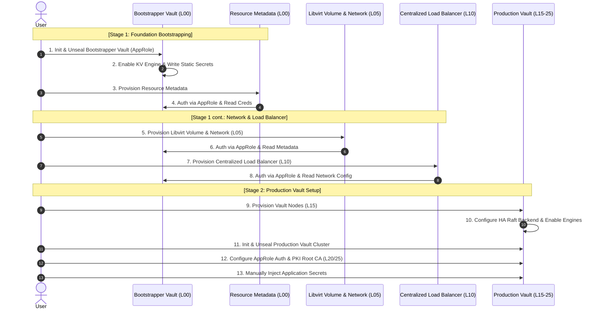
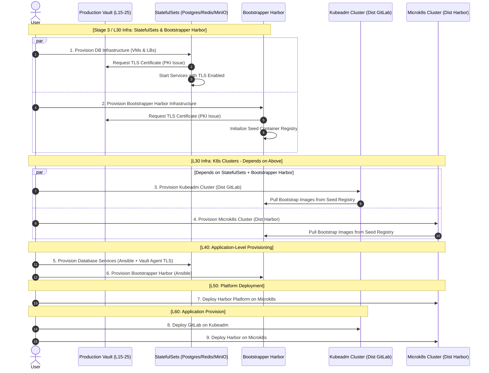

# Deployment Workflow

This repo leverages Packer, Terraform, and Ansible to implement an automated pipeline. Adhering to immutable infrastructure principles, it automates the entire lifecycle, from VM image creation to the provisioning of a complete Kubernetes cluster.

The automated deployment process is divided into the following stages. Deployment sequence and dependencies strictly follow internal system logic:

## Stage 1: Foundation — Libvirt, Networking, and Secret Management

## Stage 3+: Application Deployment Dependencies

## Toolchain References

> [!NOTE]
> Procedures derived directly from official documentation are omitted from the list below.
>
> 1. Bibin Wilson, B. (2025). [_How To Setup Kubernetes Cluster Using Kubeadm._](https://devopscube.com/setup-kubernetes-cluster-kubeadm/#vagrantfile-kubeadm-scripts-manifests) devopscube.
> 2. Aditi Sangave (2025). [_How to Setup HashiCorp Vault HA Cluster with Integrated Storage (Raft)._](https://www.velotio.com/engineering-blog/how-to-setup-hashicorp-vault-ha-cluster-with-integrated-storage-raft) Velotio Tech Blog.
> 3. Dickson Gathima (2025). [_Building a Highly Available PostgreSQL Cluster with Patroni, etcd, and HAProxy._](https://medium.com/@dickson.gathima/building-a-highly-available-postgresql-cluster-with-patroni-etcd-and-haproxy-1fd465e2c17f) Medium.
> 4. Deniz TÜRKMEN (2025). [_Redis Cluster Provisioning — Fully Automated with Ansible._](https://deniz-turkmen.medium.com/redis-cluster-provisioning-fully-automated-with-ansible-dc719bb48f75) Medium.
