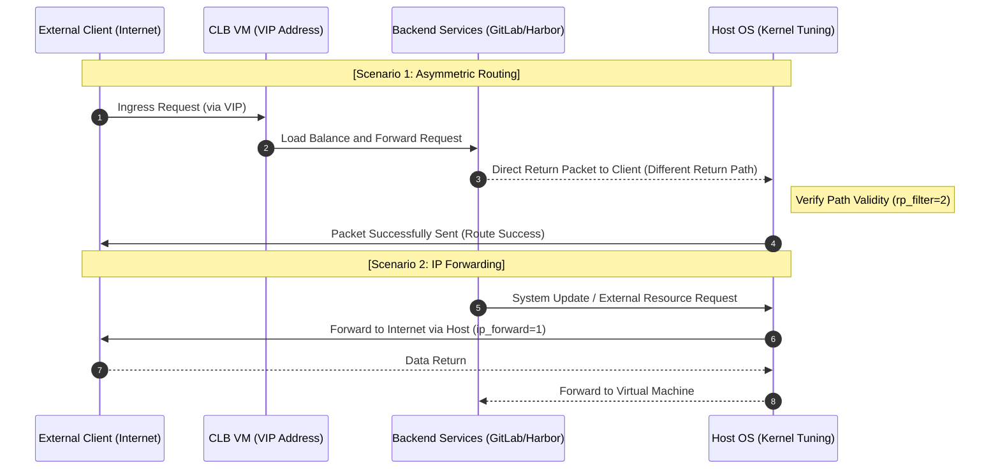
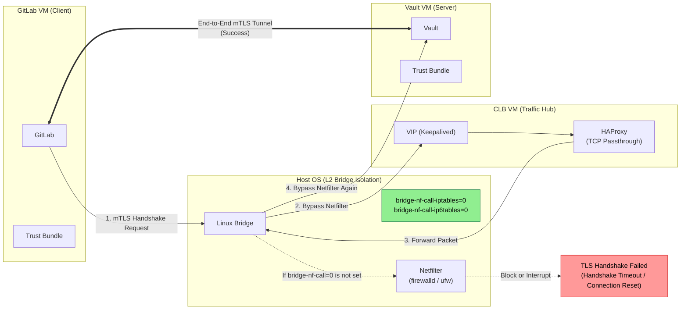
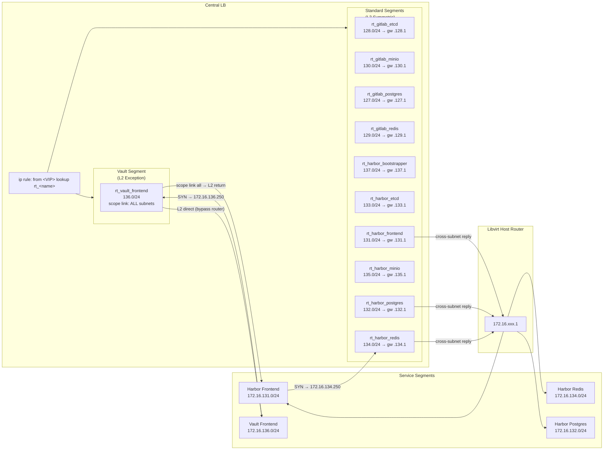

# Network Topology

## Host OS Kernel Tuning: The Why

> [!IMPORTANT]
> The system operates under a Centralized Load Balancer architecture where inter-node communication primarily follows an **Asymmetric Routing** pattern. To ensure the operational integrity of **VIP (Keepalived)**, **PKI**, and **OCI** services, the Host machine must be configured with the following settings.

### Asymmetric Routing and Reverse Path Filtering

First, configure Reverse Path Filtering to **loose mode**. Under an asymmetric routing architecture, return packets may arrive from a different network interface. Strict Mode will flag this as IP spoofing and drop the packets directly.

### Bridge Netfilter and mTLS

Libvirt's bridge will send L2 traffic to the Host's iptables for processing by default. In high-traffic scenarios or complex mTLS handshakes, this usually causes double filtering and connection state tracking (Conntrack) conflicts. Therefore, **the bridge must be disabled from invoking `netfilter`**, allowing routing decisions to return to L3 processing.

Failure to disable this may lead to mTLS failures between guests (e.g., between GitLab and Vault). After setting `bridge-nf-call-*=0`, pure L2 packets forwarded by the bridge will directly bypass the Host's Netfilter and no longer consume Conntrack resources. However, inter-segment L3 routing traffic will still be managed by the Host's Conntrack. Therefore, the total capacity and recycling efficiency of the Conntrack table must be increased, and TCP state validation must be relaxed to ensure connections are not mistakenly terminated during high traffic and HA failovers.

### MTU / MSS

Since the infrastructure MTU is set to 1450 (with overhead reserved for VXLAN encapsulation), the MSS must be forcibly modified in the Host's `mangle` table to prevent TCP packets from being too large, which would result in fragmentation or black hole issues.

> For the actual sysctl commands, see [Kernel Tuning](../configuration/kernel-tuning.md).

---

## Policy-Based Routing (PBR) on the Central LB

