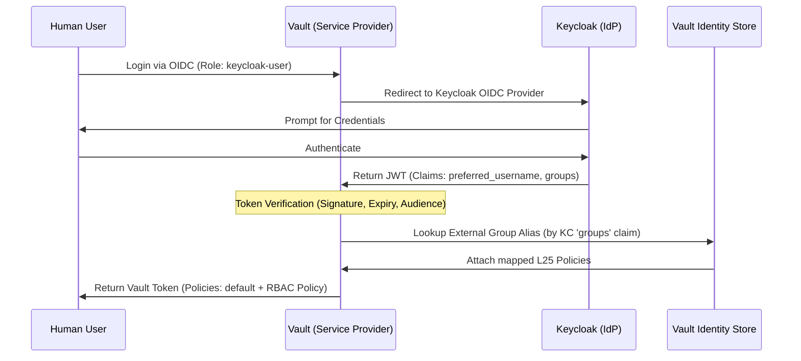

# Infrastructure OIDC & RBAC Architecture

This document describes the standardized OIDC integration between Keycloak (Identity Provider) and HashiCorp Vault (Service Provider), leveraging a multi-layer Terraform approach for granular Access Control (RBAC).

## Layered Responsibilities

### [L20] Foundation AppRole & Initial Policy

- **Responsibility**: Bootstrapping the "Terraform Admin" identity.
- **Key Outcome**: Established the `production-terraform-admin` AppRole and its initial `production-terraform-admin-policy`. This is the identity used by all subsequent layers to interact with the Vault API.

### [L25] ACL Source of Truth (SSoT)

- **Responsibility**: Defining "What" permissions exist.
- **Key Outcomes**:
    - **Infrastructure Super-Admin**: Centralized the management of `production-terraform-admin-policy`, granting it full power over `auth/*`, `sys/*`, `pki/*`, and `secret/*` to prevent permission deadlocks.
    - **Role Definitions**: Defined standardized management tiers (`oidc-admin`, `oidc-auditor`, `oidc-developer`) and their respective ACL policies.
    - **Interface**: Exported `management_policies` map for consumption by L45.

### [L40] Identity Provider (Keycloak) Provisioning

- **Responsibility**: Defining "Who" the users are and creating the OIDC trust.
- **Key Outcomes**:
    - **OIDC Client**: Created the `vault-infra` client in the `infra-company` realm.
    - **Protocol Mappers**:
        - `groups`: Injects Keycloak group memberships into the JWT `groups` claim.
        - `audience`: Injects `vault-infra` into the `aud` claim to satisfy Vault's verification.
    - **Credential SSoT**: Stored OIDC Client ID and Secret into Vault KV (`secret/data/.../oidc/clients/vault`).
    - **Redirect Strategy**: Configured support for both Vault UI (`https://<vault-ui-host>/ui/vault/auth/oidc/oidc/callback`) and Vault CLI (`http://localhost:8250/oidc/callback`). The `localhost` URI is exclusively for ephemeral CLI login flows (`vault login -method=oidc`) and must not be used for browser-based production flows.

### [L45] Vault OIDC Integration & Group Mapping

- **Responsibility**: Wiring the OIDC protocol to Vault Identity.
- **Key Outcomes**:
    - **Auth Backend**: Enabled `oidc` backend with `oidc_discovery_ca_pem` to trust the internal CA.
    - **Unified Role**: Created `keycloak-user` role using `preferred_username` for human-readable entity names.
    - **Dynamic RBAC**:
        - Created **External Identity Groups** based on L25 definitions.
        - Created **Group Aliases** to map Keycloak `groups` claims to Vault Identity Groups.

## Authentication & Authorization Flow

## Critical Design Decisions

1. **Decoupled Policies**: Policies are defined in L25 as raw ACLs, completely unaware of the authentication method (OIDC).
2. **External Group Mapping**: By using `external` groups and aliases in L45, users are assigned permissions based on their Keycloak membership _at the time of login_. No manual policy assignment is needed in Vault.
3. **Internal CA Trust**: Vault explicitly trusts the internal Root CA for OIDC discovery, ensuring secure end-to-end TLS without bypassing verification.
4. **Human-Readable Entities**: Using `preferred_username` instead of `sub` (UUID) ensures that the Vault `identity_entity` names are manageable and recognizable in audit logs.
