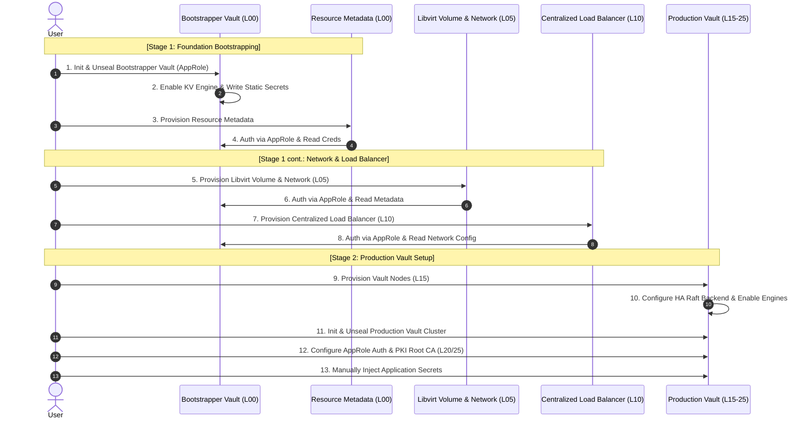
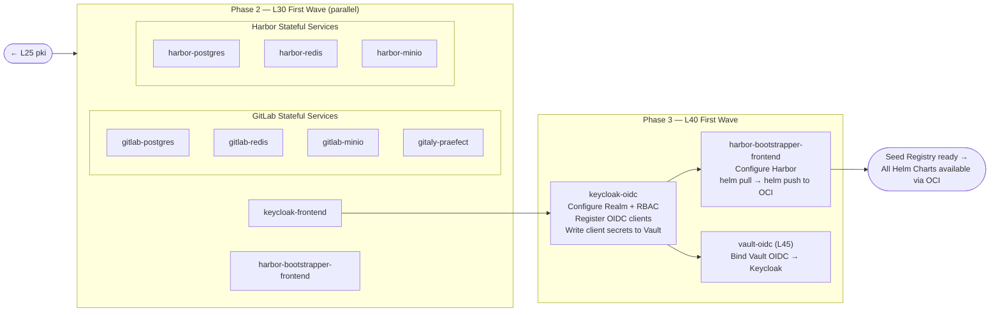
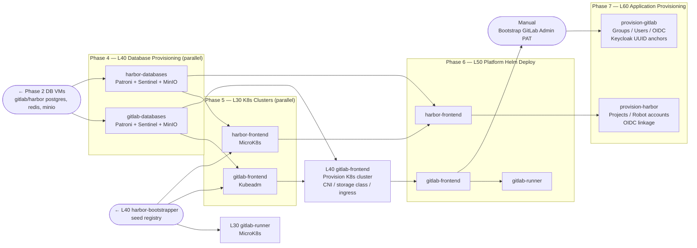

# Deployment Order

Each layer reads prior layers' state via `terraform_remote_state`. Layers within the same phase can be applied in parallel unless noted otherwise.

---

## Pre-Flight

Before applying any Terraform layer, complete all steps in [Prerequisites](01-prerequisites.md), [Environment Setup](02-environment-setup.md), and [Initialization](03-initialization.md).

---

## Dependency Diagrams

Three left-to-right diagrams, each building on the previous stage.

---

### Stage 1 — Foundation

---

### Stage 2 — Harbor Bootstrapper Assembly

> All L30 VM layers follow the same pattern: authenticate to Production Vault via AppRole, then receive a TLS leaf certificate (auto-rotated by Vault Agent sidecar).

---

### Stage 3 — Harbor + GitLab Deployment

---

## Notes

1. **Phase 8 — L90: Repository Meta (Optional)**

    `90-meta-github` and `90-meta-gitlab` can be applied at any point after Bootstrapper Vault is initialized. Both require a first-time `terraform import` before applying. See [GitHub Meta](../operations/github-meta.md) and [Initialization → GitLab.com Credentials](03-initialization.md#gitlabcom-credentials-for-mirror-management).

2. **L50 GitLab: `OpenSSL::Cipher::CipherError`**

    If this error occurs in the `gitlab-migrations` pod, see the [troubleshooting guide](../operations/troubleshooting.md#gitlab-application). Caused by `rails-secret` regeneration against a preserved database from a prior deployment.
