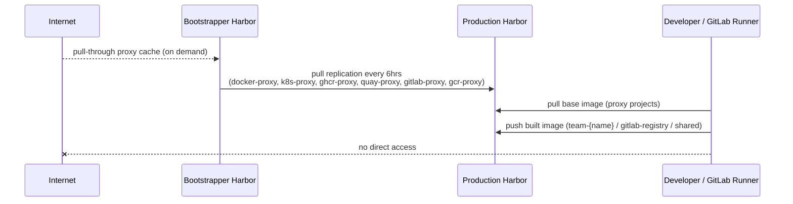

# Production Harbor Operations

## Architecture Overview

Production Harbor serves as the primary OCI artifact registry for development teams.
It is **air-gapped from the internet** — all external base images arrive via replication
from Bootstrapper Harbor.



### Project Access Matrix

| Project             | Who can push          | Who can pull         |
| ------------------- | --------------------- | -------------------- |
| `shared`            | All teams (Developer) | All teams            |
| `team-{name}`       | Own team (Developer)  | Own team + dev-leads |
| `docker-proxy` etc. | Replication only      | Public (no auth)     |
| `gitlab-registry`   | GitLab CI robot       | GitLab CI robot      |
| `library`           | Admin                 | Public (no auth)     |

### OIDC Group → Harbor Role Mapping

Groups are derived from Keycloak (type=team → team project, type=role → cross-team):

| Keycloak Group                              | Harbor Role          | Scope                      |
| ------------------------------------------- | -------------------- | -------------------------- |
| `dev-a`, `dev-b`, `dev-c`, `dev-d`, `infra` | Developer            | Own team project + shared  |
| `dev-leads`                                 | Maintainer           | All team projects + shared |
| `admin`                                     | System Administrator | All                        |

---

## Authentication

### Web UI (OIDC)

Browse to `https://harbor.production.iac.local` and click **Login with OIDC Provider**.
Redirects to Keycloak; use your SSO credentials.

### CLI (Podman / Docker)

OIDC tokens cannot be used directly with `podman login`. You need a **CLI Secret**:

1. Log in to Harbor UI via OIDC
2. Click your avatar (top-right) → **User Profile** → **CLI Secret** → copy
3. Use it as the password:

```sh
podman login harbor.production.iac.local \
    -u <your-keycloak-username> \
    -p <cli-secret>
```

### Admin Account (local auth — bypasses OIDC)

Admin uses basic auth directly against the API even when OIDC is `primary_auth_mode`.
Credentials are in Vault:

```sh
export VAULT_ADDR="https://172.16.136.250:443"
export VAULT_CACERT="${PWD}/terraform/layers/15-shared-vault-frontend/tls/bootstrap-ca.crt"
export VAULT_TOKEN=$(VAULT_ADDR="https://127.0.0.1:8200" VAULT_CACERT="${PWD}/vault/tls/ca.pem" VAULT_TOKEN=$(cat $HOME/.vault-token) vault kv get -field=prod_vault_root_token secret/on-premise-gitlab-deployment/credentials)

vault kv get -mount=secret -field=harbor_admin_password \
  on-premise-gitlab-deployment/harbor/app
```

```sh
podman login harbor.production.iac.local -u admin -p <password>
```

---

## Pushing Images

### From Local Podman

1. Log in (use CLI Secret from Harbor UI, or admin password)

    ```shell
    podman login harbor.production.iac.local
    ```

2. Tag your image to the appropriate project

    ```shell
    podman tag my-app:latest \
      harbor.production.iac.local/team-dev-a/my-app:latest
    ```

3. Push

    ```shell
    podman push harbor.production.iac.local/team-dev-a/my-app:latest
    ```

For GitLab CI pipeline configuration, see the CI guide (to be added after runner testing).

---

## Helm Charts as OCI Artifacts

Harbor natively supports OCI artifacts in any project. No separate setup needed.
Push Helm charts to the appropriate team project:

```sh
helm push my-chart.tgz \
    oci://harbor.production.iac.local/team-dev-a/
```

Pull:

```sh
helm pull \
    oci://harbor.production.iac.local/team-dev-a/my-chart --version 1.0.0
```

---

## Bootstrapper Mirror Replication

Proxy cache projects (`docker-proxy`, `k8s-proxy`, `ghcr-proxy`, `quay-proxy`,
`gitlab-proxy`, `gcr-proxy`) are synchronized from Bootstrapper Harbor every **6 hours**
automatically.

### Manual Trigger

Harbor GUI → **Administration** → **Replications** → select
`mirror-from-bootstrapper-{project}` → click **Replicate**.

Or via API:

```sh
HARBOR_HOST="harbor.production.iac.local"
ADMIN_PASS=$(vault kv get -mount=secret -field=harbor_admin_password \
    on-premise-gitlab-deployment/harbor/app)

# Get replication policy IDs
curl -s -u "admin:${ADMIN_PASS}" \
    "https://${HARBOR_HOST}/api/v2.0/replicationpolicies" | jq '.[].id'

# Trigger a specific policy (replace <id>)
curl -s -X POST -u "admin:${ADMIN_PASS}" \
    "https://${HARBOR_HOST}/api/v2.0/replications" \
    -H "Content-Type: application/json" \
    -d '{"policy_id": <id>}'
```

---

## Troubleshooting

### Harbor registry pod logs

```sh
ssh core-harbor-frontend-node-00 \
    "kubectl -n harbor logs -l app=harbor,component=registry --tail=50"
```

### MinIO S3 endpoint — connection refused on port 443

**Symptom**: blob upload returns HTTP 500; registry logs show
`dial tcp 172.16.135.250:443: connect: connection refused`.

**Root cause**: Harbor's S3 endpoint was configured without an explicit port, defaulting
to 443. MinIO's API port is **9000**.

**Fix** (already applied in `50-platform-harbor-frontend/main.tf`):

```hcl
s3 = {
    endpoint = "https://${local.minio_fqdn}:${local.minio_port}"  # port 9000
}
```

Re-apply `50-platform-harbor-frontend` to update the Helm release.

### OIDC Duplicate User Conflict

See [`60-provision-harbor/README.md`](../../../terraform/layers/60-provision-harbor/README.md)
for the database cleanup procedure.

### Harbor admin 401 during Terraform apply (refresh phase)

**Symptom**: `terraform plan` or `terraform apply` returns 401 on Harbor resources
after OIDC was enabled.

**Workaround**: Use `-refresh=false` to skip Harbor API refresh and apply only config
changes. Existing state is trusted as-is.

```sh
terraform apply -refresh=false
```

The Harbor provider in `60-provision-harbor` uses `admin` basic auth (which works even
with OIDC `primary_auth_mode = true` via the `/api/v2.0` endpoint).
