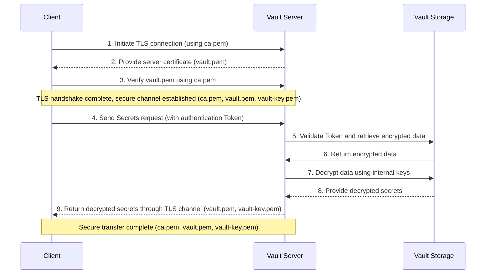

# Tutorial: Configure HashiCorp Vault

> **TL;DR**
> 此 Podman Vault 的定位為 **Bootstrapper (Seed Vault)**，專門運行於控制節點本機。在底層 KVM/Libvirt 基礎設施尚未建立前，主機必須透過此本機 Vault 提供一個安全的 Remote State Backend 以存放狀態，並保存啟動基礎設施所需的初始機密（如 VM 預設登入憑證、Root PKI CA）。後續執行 `terraform/layers/15-shared-vault-frontend` 時，Terraform 將會登入此本機 Podman Vault 提取 KVM 叢集必備之網路拓樸與憑證，藉此建立正式的共用基礎設施。這是此本機 Vault 必須存在且作為過渡核心的根本原因。

## Section 1. Start Vault Dev Server for PoC

### **Step A. Set up a Vault Dev server**

> [!WARNING]
> **注意：Dev Mode 模式是使用記憶體儲存後端**
>
> 這代表若停止開發伺服器的運作時，就會無法存取到被寫入伺服器的任何資料

- 有關 Dev Mode 的設定選項，可以參考 `vault server -help` 中的 “Dev Options” 內容

    ```text
    Dev Options:
      -dev
          Enable development mode. In this mode, Vault runs in-memory and starts
          unsealed. As the name implies, do not run "dev" mode in production. The
          default is false.

      -dev-cluster-json=<string>
          File to write cluster definition to

      -dev-listen-address=<string>
          Address to bind to in "dev" mode. The default is 127.0.0.1:8200. This
          can also be specified via the VAULT_DEV_LISTEN_ADDRESS environment
          variable.

      -dev-no-store-token
          Do not persist the dev root token to the token helper (usually the local
          filesystem) for use in future requests. The token will only be displayed
          in the command output. The default is false.

      -dev-root-token-id=<string>
          Initial root token. This only applies when running in "dev" mode.
          This can also be specified via the VAULT_DEV_ROOT_TOKEN_ID environment
          variable.

      -dev-tls
          Enable TLS development mode. In this mode, Vault runs in-memory and
          starts unsealed, with a generated TLS CA, certificate and key. As the
          name implies, do not run "dev-tls" mode in production. The default is
          false.

      -dev-tls-cert-dir=<string>
          Directory where generated TLS files are created if `-dev-tls` is
          specified. If left unset, files are generated in a temporary directory.

      -dev-tls-san=<string>
          Additional Subject Alternative Name (as a DNS name or IP address)
          to generate the certificate with if `-dev-tls` is specified. The
          certificate will always use localhost, localhost4, localhost6,
          localhost.localdomain, and the host name as alternate DNS names,
          and 127.0.0.1 as an alternate IP address. This flag can be specified
          multiple times to specify multiple SANs.
    ```

1. 在終端機透過以下指令開啟 Vault 伺服器

    ```bash
    vault server -dev
    ```

    可以看到以下輸出

    ```text
    Administrative Namespace:
                Api Address: http://127.0.0.1:8200
                        Cgo: disabled
            Cluster Address: https://127.0.0.1:8201
    ```

    ```text
    You may need to set the following environment variables:

        $ export VAULT_ADDR='http://127.0.0.1:8200'

    The unseal key and root token are displayed below in case you want to
    seal/unseal the Vault or re-authenticate.

    **Unseal Key: Tc0...+5.../cqI=
    Root Token: hvs.Ay...Bl**

    Development mode should NOT be used in production installations!
    ```

2. 這時需要在終端機開啟另一個視窗，匯出以下環境變數

    ```bash
    export VAULT_ADDR='http://127.0.0.1:8200'
    export VAULT_TOKEN="hvs.Ay...Bl"  # This is Root Token above
    ```

    將 Unseal Key 匯出成一個檔案。建議切換到專案目錄下

    ```bash
    echo "Tc0...+5.../cqI=" > unseal.key  # This is the Unseal Key above
    ```

    另外有一個變數是 `VAULT_CACERT`，專門用在指定要與 Vault 做連線的 TLS 憑證的路徑。目前在這階段還不會使用到

3. 透過終端機查看 Server 的狀況

    ```bash
    vault status
    ```

    輸出應如下

    ```text
    Key             Value
    ---             -----
    Seal Type       shamir
    Initialized     true
    Sealed          false
    Total Shares    1
    Threshold       1
    Version         2.0.1
    Build Date      2025-08-27T10:53:27Z
    Storage Type    inmem
    Cluster Name    vault-cluster-ec73a2f7
    Cluster ID      079c2741-151c-5e8e-aaaf-eb91fa08da41
    HA Enabled      false
    ```

現在 Vault 裡面就像是一個空的保險箱，接下來就是要將明文設定的敏感資訊，例如環境變數檔案等，存入 Vault 裡面進行統一管理

### **Step B.** Store All Confidential Information into Vault

1. 在 `vault server -dev` 模式中，伺服器已經預設啟用了一個 KV 引擎在 `secret/` 路徑下，所以可以將所有變數存放在 `secret/some-project/variables` 這個路徑下進行集中管理。其中 `some-project` 是專案的名稱，而 `variable` 路徑就是存放變數的子目錄。假定有以下變數

    ```bash
    ssh_username="some-user-name-for-ssh"
    ssh_password="some-user-password-for-ssh"
    ssh_password_hash=$(echo -n "$ssh_password" | mkpasswd -m sha-512 -P 0)
    vm_username="some-user-name-for-vm"
    vm_password="some-user-password-for-vm"
    ssh_public_key_path="~/.ssh/some-ssh-key-name.pub"
    ssh_private_key_path="~/.ssh/some-ssh-key-name"
    ```

2. 將所有敏感變數寫入 Vault 中

    ```bash
    vault kv put secret/some-project/variables \
        ssh_username="some-user-name-for-ssh" \
        ssh_password="some-user-password-for-ssh" \
        ssh_password_hash=$(echo -n "$ssh_password" | mkpasswd -m sha-512 -P 0) \
        vm_username="some-user-name-for-vm" \
        vm_password="some-user-password-for-vm" \
        ssh_public_key_path="~/.ssh/some-ssh-key-name.pub" \
        ssh_private_key_path="~/.ssh/some-ssh-key-name"
    ```

    可以看到以下輸出

    ```text
    ========== Secret Path ==========
    secret/data/some-project/variables

    ======= Metadata =======
    Key                Value
    ---                -----
    created_time       2025-09-05T07:42:04.626736783Z
    custom_metadata    <nil>
    deletion_time      n/a
    destroyed          false
    version            1
    ```

3. 驗證方式就是使用以下指令查看變數

    ```bash
    vault kv get secret/some-project/variables
    ```

    除了前述輸出內容外，還會印出 Data 內存放的 Key-value pair

    ```text
    ============ Data ============
    Key                     Value
    ---                     -----
    ssh_password            some-user-password-for-ssh
    ssh_password_hash       $6...iV/
    ssh_private_key_path    ~/.ssh/some-ssh-key-name
    ssh_public_key_path     ~/.ssh/some-ssh-key-name.pub
    ssh_username            some-user-name-for-ssh
    vm_password             some-user-password-for-vm
    vm_username             some-user-name-for-vm
    ```

## Section 2. Set up Persistent Vault for a Project

前述所使用的 Dev Server 僅可以做為工作流程的概念驗證，因為每一次將主機 Server 的終端機 Session 關掉後，所有的密文都會消失，因此要建立一個具有永久除存性質的 Vault，也就是 Production Server。而 HashiCorp Vault 主要會使用 Raft 做為後端 Key 檔案系統。

Ref：<https://developer.hashicorp.com/vault/docs/configuration>

### Step A. Establish the Structure

1. 一個基本的 Vault 目錄會包含以下結構：

    ```bash
    .
    └── vault
        ├── vault.hcl
        └── data
    ```

2. 在終端機建立目錄：

    ```bash
    mkdir -p vault/data
    ```

3. 建立一個基本的 Config 檔案：
    - 使用 HTTP

        ```bash
        cat << EOF > vault/vault.hcl
        ui            = true
        api_addr      = "http://127.0.0.1:8200"
        cluster_addr  = "http://127.0.0.1:8201"
        disable_mlock = true

        storage "raft" {
            node_id = "node1"
            path    = "/opt/vault/data"
        }

        listener "tcp" {
            address     = "127.0.0.1:8200"
            tls_disable = true
        }
        EOF
        ```

    - 使用 HTTPS，差異在 `tls_*` 相關設定

        ```bash
        cat << EOF > vault/vault.hcl
        ui            = true
        api_addr      = "https://127.0.0.1:8200"
        cluster_addr  = "https://127.0.0.1:8201"
        disable_mlock = false

        storage "raft" {
            node_id = "node1"
            path    = "/opt/vault/data"
        }

        listener "tcp" {
            address       = "127.0.0.1:8200"
            tls_disable   = false
            tls_cert_file = "/opt/vault/tls/vault.pem"
            tls_key_file  = "/opt/vault/tls/vault-key.pem"
        }
        EOF
        ```

### Step B. （HTTPS only）Set up CA Certs for TLS



1. 建立存放 TLS 金鑰所需要的目錄

    ```bash
    mkdir -p vault/tls
    ```

2. 建立憑證的第一步，就是產生 CA Private Key

    ```bash
    openssl genrsa -out vault/tls/ca-key.pem 2048
    ```

3. 使用剛剛產生的 CA 私鑰（`ca-key.pem`）來建立一個自簽署的 CA 憑證（`ca.pem`）。這個憑證就是自己的「憑證頒發機構」

    ```bash
    openssl req -new -x509 -days 365 \
        -key vault/tls/ca-key.pem \
        -sha256 -out vault/tls/ca.pem
    ```

4. 產生一組 Vault 伺服器本身的一把 Private Key，要與伺服器憑證配對做使用

    ```bash
    openssl genrsa -out vault/tls/vault-key.pem 2048
    ```

5. 使用伺服器私鑰（`vault-key.pem`） 來建立一個 CSR （Certificate Signing Request，憑證簽署請求） 檔案，其內容主要是包含伺服器的公開金鑰和一些識別用的資訊

    ```bash
    openssl req -subj "/CN=localhost" -sha256 -new \
        -key vault/tls/vault-key.pem \
        -out vault/tls/vault.csr
    ```

6. 最後使用 CA（`ca.pem` 和 `ca-key.pem`）來簽署伺服器的 CSR（`vault.csr`）

    ```bash
    echo "subjectAltName = DNS:localhost,IP:127.0.0.1" > \
        vault/tls/extfile.cnf && \
        openssl x509 -req -days 365 -sha256 -in vault/tls/vault.csr \
        -CA vault/tls/ca.pem -CAkey vault/tls/ca-key.pem \
        -CAcreateserial -out vault/tls/vault.pem \
        -extfile vault/tls/extfile.cnf
    ```

7. 刪除不再需要的 `vault.csr` 和 `extfile.cnf` 檔案

    ```bash
    rm vault/tls/vault.csr vault/tls/extfile.cnf
    ```

### Step C. Start the Server

1. 退回專案的根目錄，就可以建立用以下指令啟動 Server

    ```bash
    vault server -config=vault/vault.hcl
    ```

2. 此時終端機會跳出啟動 Server 的訊息，這個視窗必須留著，而後另開一個視窗進行初始化：
    - HTTP

        ```bash
        export VAULT_ADDR="http://127.0.0.1:8200"
        vault operator init
        ```

    - HTTPS

        ```bash
        export VAULT_ADDR="https://127.0.0.1:8200"
        vault operator init \
            -address="${VAULT_ADDR}" \
            -ca-cert="${PWD}/vault/tls/ca.pem" \
        ```

3. 終端機會跳出 一次性的 Unseal Key 與 Initial Root Token

    ```text
    Unseal Key 1: nMn...FnV
    Unseal Key 2: 8oN...P3t
    Unseal Key 3: tq/...lMW
    Unseal Key 4: U2I...by8
    Unseal Key 5: A48...MX1
    Initial Root Token: hvs.Cz...HIC
    ```

    需要將這些資料存放在一個隱密的地方中，例如在專案根目錄中

    ```bash
    touch unseal.key
    chmod 600 unseal.key
    ```

    並且加入 `.gitignore`

    ```bash
    cat << EOF >> .gitignore
    unseal.key
    EOF
    ```

4. 可以注意到終端機會有一串訊息：

    > _Vault 已初始化，共有 5 個密鑰份額和 3 個密鑰閾值。請安全地分發上面列印的密鑰份額。當 Vault 重新封存、重啟或停止時，您必須提供至少 3 個這些密鑰才能解封它，然後它才能開始處理請求。
    > Vault 不會儲存生成的根密鑰。如果沒有至少 3 個密鑰來重建根密鑰，Vault 將保持永久封存狀態！
    > 只要您擁有現有密鑰份額的法定數量，就可以生成新的解封密鑰。請參閱「vault operator rekey」獲取更多資訊_

    也就是說，在完成初始化、或是其餘時候剛啟動 Server 的階段，需要對 Vault 進行解封。假定就取其中三個 Key 進行，可以注意到輸出會有 `Unseal Progress 1/3` 字樣
    - HTTP

        ```bash
        vault operator unseal nMn...FnV
        vault operator unseal 8oN...P3t
        vault operator unseal tq/...lMW
        ```

    - HTTPS

        ```bash
        vault operator unseal \
            -address="${VAULT_ADDR}" \
            -ca-cert="${PWD}/vault/tls/ca.pem" \
            nMn...FnV
        vault operator unseal  \
            -address="${VAULT_ADDR}" \
            -ca-cert="${PWD}/vault/tls/ca.pem" \
            8oN...P3t
        vault operator unseal  \
            -address="${VAULT_ADDR}" \
            -ca-cert="${PWD}/vault/tls/ca.pem" \
            tq/...lMW
        ```

    完成後會看到以下訊息

    ```text
    Key                     Value
    ---                     -----
    Seal Type               shamir
    Initialized             true
    Sealed                  false
    Total Shares            5
    Threshold               3
    Version                 2.0.1
    Build Date              2025-08-27T10:53:27Z
    Storage Type            raft
    Cluster Name            vault-cluster-38891d31
    Cluster ID              ecdd29c8-5173-37d1-461b-b1941d4674e4
    Removed From Cluster    false
    HA Enabled              true
    HA Cluster              n/a
    HA Mode                 standby
    Active Node Address     <none>
    Raft Committed Index    32
    Raft Applied Index      32
    ```

### Step D. Login and Put Secret

1. 隨後就可以用 Initial Root Token 進行登入了
    - HTTP

        ```bash
        vault login hvs.Cz...HIC
        ```

    - HTTPS

        ```bash
        vault login \
            -address="${VAULT_ADDR}" \
            -ca-cert="${PWD}/vault/tls/ca.pem" \
            hvs.Cz...HIC
        ```

    終端機輸出如下：

    > 成功！您現已通過身份驗證。以下顯示的 token 資訊已經儲存在 token 輔助程式中。您不需要再次執行 `vault login`。未來的 Vault 請求將自動使用此 token 。

2. 要手動啟用 `kv` 金鑰引擎，並將其 mount 到專案所需的 `secret/` 路徑上
    - HTTP

        ```bash
        vault secrets enable -path=secret kv-v2
        ```

    - HTTPS

        ```bash
        vault secrets enable \
            -address="${VAULT_ADDR}" \
            -ca-cert="${PWD}/vault/tls/ca.pem" \
            -path=secret kv-v2
        ```

    若看到 `Success! Enabled the kv-v2 secrets engine at: secret/` 就代表完成

3. 可以將專案的所有 Confidential 資訊都放入 Vault，如：
    - HTTP

        ```bash
        vault kv put secret/some-project/variables \
            ssh_username="some-user-name-for-ssh" \
            ssh_password="some-user-password-for-ssh" \
            ssh_password_hash=$(echo -n "$ssh_password" | mkpasswd -m sha-512 -P 0) \
            vm_username="some-user-name-for-vm" \
            vm_password="some-user-password-for-vm" \
            ssh_public_key_path="~/.ssh/some-ssh-key-name.pub" \
            ssh_private_key_path="~/.ssh/some-ssh-key-name"
        ```

    - HTTPS

        ```bash
        vault kv put \
            -address="${VAULT_ADDR}" \
            -ca-cert="${PWD}/vault/tls/ca.pem" \
            secret/some-project/variables \
            ssh_username="some-user-name-for-ssh" \
            ssh_password="some-user-password-for-ssh" \
            ssh_password_hash=$(echo -n "$ssh_password" | mkpasswd -m sha-512 -P 0) \
            vm_username="some-user-name-for-vm" \
            vm_password="some-user-password-for-vm" \
            ssh_public_key_path="~/.ssh/some-ssh-key-name.pub" \
            ssh_private_key_path="~/.ssh/some-ssh-key-name"
        ```

4. 隨後就可以用以下指令確認存放的 key：
    - HTTP

        ```bash
        vault kv get secret/some-project/variables
        ```

    - HTTPS

        ```bash
        vault kv get \
            -address="${VAULT_ADDR}" \
            -ca-cert="${PWD}/vault/tls/ca.pem" \
            secret/some-project/variables
        ```

    輸出應如下：

    ```text
    ========== Secret Path ==========
    secret/data/some-project/variables

    ======= Metadata =======
    Key                Value
    ---                -----
    created_time       2025-09-06T05:10:13.541661282Z
    custom_metadata    <nil>
    deletion_time      n/a
    destroyed          false
    version            1

    ============ Data ============
    Key                     Value
    ---                     -----
    ssh_password            some-user-password-for-ssh
    ssh_password_hash       hashed-ome-user-password-for-ssh
    ssh_private_key_path    ~/.ssh/some-ssh-key-name
    ssh_public_key_path     ~/.ssh/some-ssh-key-name.pub
    ssh_username            some-user-name-for-ssh
    vm_password             some-user-password-for-vm
    vm_username             some-user-name-for-vm
    ```

    如果要針對不同路徑加入 Secrets，可以透過不同的路徑達成。例如要針對 HA Postgres 新增 Secrets，可以用以下方式達成：

    ```bash
    vault kv put \
        -address="https://127.0.0.1:8200" \
        -ca-cert="${PWD}/vault/tls/ca.pem" \
        secret/on-premise-gitlab-deployment/databases \
        pg_superuser_password="a-more-secure-pwd-for-superuser" \
        pg_replication_password="a-more-secure-pwd-for-replication"
    ```

## Section 3. Containerize the Persistent Vault

建立容器的主要目的，是透過容器處理 Vault 伺服器的架設

**`hashicorp/vault`** By HashiCorp, an IBM Company

hub.docker.com

### Step A. Create a compose file

回顧 Section 2. Step A.0 的目錄結構，可以撰寫出以下 Compose 檔案。其中 `:z` 標籤是針對開啟 SELinux 系統（如 RHEL、Fedora、CentOS 等）的設定，因為在 Podman 環境下，會需要將 host 端目錄的 SELinux Context 做 Relabel 為該容器專用（`container_file_t`），確保容器內的行程具備讀寫這些檔案的權限，避免觸發 Permission Denied 錯誤

```yaml
---
services:
    iac-vault-server:
        image: docker.io/hashicorp/vault:2.0
        container_name: iac-vault-server
        entrypoint: "vault"
        command: server -config=/opt/vault/vault.hcl
        volumes:
            - ./vault/vault.hcl:/opt/vault/vault.hcl:z
            - ./vault/data:/opt/vault/data:z
            - ./vault/tls:/opt/vault/tls:z
        user: "${HOST_UID}:${HOST_GID}"
        cap_add:
            - IPC_LOCK
        network_mode: "host"
        userns_mode: keep-id
        environment:
            - SKIP_SETCAP=true
            - VAULT_ADDR=https://127.0.0.1:8200
        healthcheck:
            test:
                [
                    "CMD-SHELL",
                    "vault status -address=https://127.0.0.1:8200 -tls-skip-verify || if [ $? -eq 2 ]; then exit 0; else exit 1; fi",
                ]
            interval: 5s
            timeout: 3s
            retries: 5
```

其中

- `command` 是參考 Section 2. Step C 啟動 Vault server 的方式
- `volume` 設定三個，分別是
    - `./vault/vault.hcl:/opt/vault/vault.hcl:z` 是設定檔的位置
    - `./vault/data:/opt/vault/data:z` 是 Raft 儲存資料的目錄
    - `./vault/tls:/opt/vault/tls:z` 是存放 TLS 憑證使用的，包含 `ca.pem`、`vault.pem`、`vault-key.pem`

### Step B. 解析 Podman Vault 的組態設定與生命週期定位

前面 `compose.yml` 檔案內部包含多個針對 Vault 安全性與 Rootless 容器環境的特定設定。以下分為三個主要部份：

- **`cap_add` 與 `environment`**：由於官方映像檔啟動時預設會執行 `setcap cap_ipc_lock=+ep /bin/vault`，但 Rootless 容器內的 `root` (UID 0) 在主機上是非特權使用者，無法在 User Namespace 內寫入擴充屬性 (XATTR)，必須設定 `SKIP_SETCAP=true` 避免容器因 `setcap` 失敗而崩潰。但因 Vault 仍需調用 `mlock(2)` 鎖定實體記憶體防範 secrets 被寫入 Swap，故須設定 `cap_add: ["IPC_LOCK"]` 以將 `CAP_IPC_LOCK` 寫入 Effective 與 Permitted Capability Sets。此外，Fedora 啟用 SELinux 時容器行程運行於 `container_t`，若無此權限設定，核心會因安全審查未通過而觸發 AVC Denial 導致服務崩潰
- **`user` 與 `userns_mode`**：分別設定 `"${HOST_UID}:${HOST_GID}"` 與 `keep-id` 用來映射主機的使用者 ID 到容器內，對齊 Rootless 容器與主機端的檔案系統權限，避免 Vault 讀取 `600` 權限的 `vault-key.pem` 私鑰時發生 Permission Denied 錯誤
- **`volumes`**：掛載目錄時加上 `:z` 標籤，標記容器引擎自動將掛載目錄的 SELinux Context 重新標記為 `container_file_t`，讓容器行程讀寫 `data/` 與 `tls/` 目錄，避免被 SELinux 阻擋
- **`network_mode`**：設定為 `host` 直接使用主機網路。通常這會依照最小攻擊面原則配合 Vault 僅監聽 `127.0.0.1` 迴圈位址，防止 API 暴露在 Docker 或 Podman 虛擬網路網段中
- **`healthcheck`**：腳本中包含 `if [ $? -eq 2 ]; then exit 0; else exit 1; fi` 判定，因 Vault 在 Sealed 狀態下執行 `status` 會回傳 Exit Code `2`。將其轉換為 `0` 可以避免容器被誤判故障而陷入無限重開的狀況
